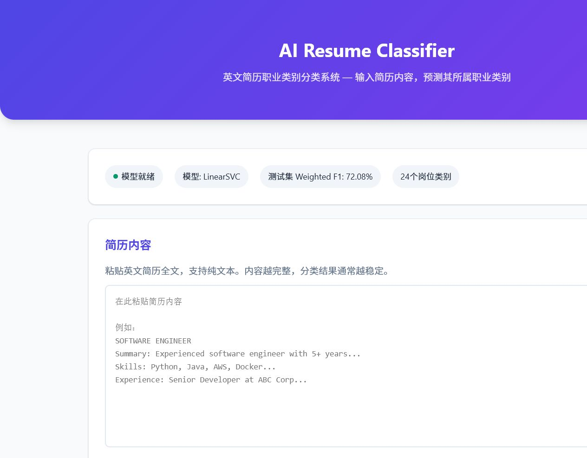
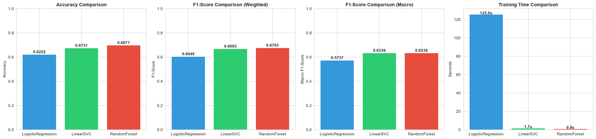
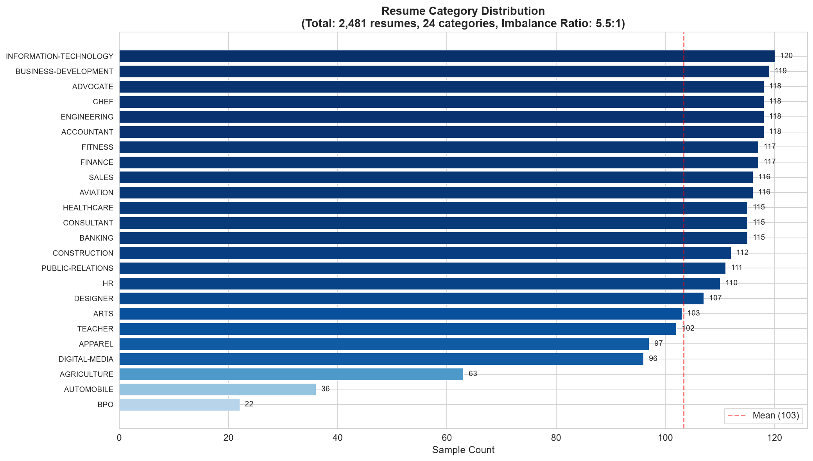
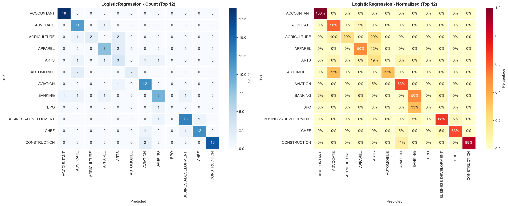
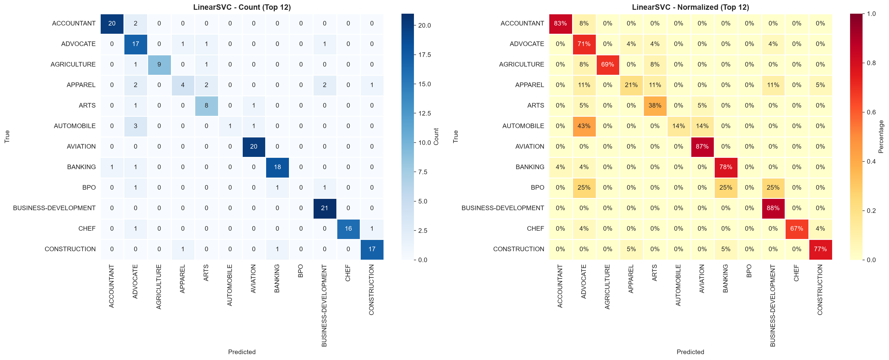
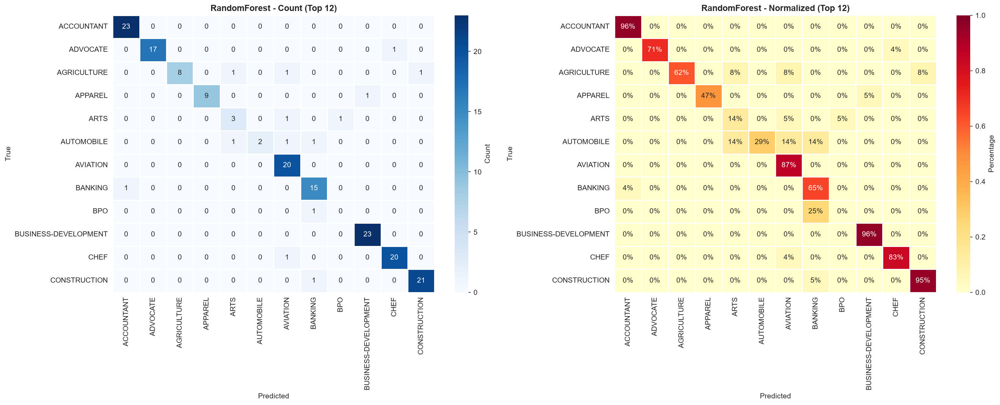

# AI Resume Classifier — 智能简历岗位匹配系统

[](https://www.python.org/)
[](https://scikit-learn.org/)
[](https://flask.palletsprojects.com/)
[](LICENSE)

基于机器学习的智能简历岗位匹配系统。输入一段简历文本，AI自动预测最适合的岗位类别（共24个岗位类别）。

**技术栈**: Python + scikit-learn + TF-IDF + Random Forest + Flask

---

## 项目展示

### Web界面


### 模型对比


### 类别分布


### 混淆矩阵
| Logistic Regression | LinearSVC | Random Forest |
|:---:|:---:|:---:|
|  |  |  |

---

## 项目结构

```
04-AI Resume Classifier/
│
├── data/                              # 数据集目录
│   ├── resume_dataset.csv             # 原始数据集（Kaggle下载）
│   └── cleaned_resume.csv             # 清洗后数据集
│
├── models/                            # 模型文件目录
│   ├── tfidf_vectorizer.pkl           # TF-IDF向量器
│   ├── best_model.pkl                 # 最佳模型（RandomForest）
│   ├── label_map.json                 # 标签映射（ID→岗位名）
│   ├── model_metadata.json            # 模型元数据
│   ├── X_train.pkl / X_test.pkl       # 训练/测试特征矩阵
│   └── y_train.pkl / y_test.pkl       # 训练/测试标签
│
├── notebooks/                         # Jupyter Notebook实验
│
├── app/                               # Flask Web应用
│   ├── __init__.py                    # 应用工厂
│   └── routes.py                      # 路由和API
│
├── templates/                         # HTML模板
│   └── index.html                     # 主页面
│
├── static/                            # 静态资源（图表等）
│   ├── category_distribution.png      # 类别分布图
│   ├── text_length_analysis.png       # 文本长度分析
│   ├── top_words.png                  # 高频词统计
│   ├── category_keywords_heatmap.png  # 特征词热力图
│   ├── model_comparison.png           # 模型对比图
│   ├── confusion_matrix_*.png         # 混淆矩阵
│   └── data_statistics.json           # 数据统计摘要
│
├── download_dataset.py                # ① 数据集下载
├── data_cleaning.py                   # ② 数据清洗
├── data_analysis.py                   # ③ 数据分析与可视化
├── feature_engineering.py             # ④ 特征工程（TF-IDF）
├── train.py                           # ⑤ 模型训练与评估
├── predict.py                         # ⑥ 预测模块
├── run.py                             # ⑦ Web应用启动入口
│
├── requirements.txt                   # 项目依赖
├── .gitignore                         # Git忽略规则
└── README.md                          # 项目文档
```

---

## 快速开始

### 环境要求

- Python 3.10+
- pip

### 1. 创建虚拟环境

```bash
# Windows
python -m venv .venv
.venv\Scripts\activate

# macOS / Linux
python3 -m venv .venv
source .venv/bin/activate
```

### 2. 安装依赖

```bash
pip install -r requirements.txt
```

### 3. 配置Kaggle（下载数据集需要）

1. 登录 [Kaggle](https://www.kaggle.com)
2. 进入 Settings → API → Create New API Token
3. 下载 `kaggle.json`
4. 放置到 `~/.kaggle/kaggle.json`（Linux/Mac）或 `C:\Users\<用户名>\.kaggle\kaggle.json`（Windows）

### 4. 下载数据集

```bash
python download_dataset.py
```

### 5. 运行完整Pipeline（训练模型）

按顺序执行以下脚本：

```bash
# 步骤1: 数据清洗
python data_cleaning.py

# 步骤2: 数据分析
python data_analysis.py

# 步骤3: 特征工程
python feature_engineering.py

# 步骤4: 模型训练
python train.py
```

### 6. 启动Web应用

```bash
python run.py
```

浏览器打开 http://127.0.0.1:5000

---

## 数据集

| 属性 | 详情 |
|------|------|
| 来源 | [Kaggle - Resume Dataset](https://www.kaggle.com/datasets/snehaanbhawal/resume-dataset) |
| 样本数 | 2,484条简历 |
| 类别数 | 24个岗位类别 |
| 语言 | 英文 |

### 24个岗位类别

| 类别 | 样本数 | | 类别 | 样本数 |
|------|--------|-|------|--------|
| INFORMATION-TECHNOLOGY | 120 | | CONSULTANT | 115 |
| BUSINESS-DEVELOPMENT | 120 | | BANKING | 115 |
| ADVOCATE | 118 | | CONSTRUCTION | 112 |
| CHEF | 118 | | PUBLIC-RELATIONS | 111 |
| FINANCE | 118 | | HR | 110 |
| ENGINEERING | 118 | | DESIGNER | 107 |
| ACCOUNTANT | 118 | | ARTS | 103 |
| FITNESS | 117 | | TEACHER | 102 |
| AVIATION | 117 | | APPAREL | 97 |
| SALES | 116 | | DIGITAL-MEDIA | 96 |
| HEALTHCARE | 115 | | AGRICULTURE | 63 |
| | | | AUTOMOBILE | 36 |
| | | | BPO | 22 |

---

## 技术方案

### 数据处理Pipeline

```
原始文本
  → 大小写统一(lowercase)
  → URL/HTML标签移除
  → 特殊字符清洗
  → 空白规范化
  → TF-IDF向量化 (5,000特征, unigram+bigram)
  → 训练集/测试集划分 (80/20, 分层抽样)
```

### 模型对比

| 模型 | Accuracy | F1-Score | 训练时间 |
|------|----------|----------|----------|
| Logistic Regression | 66.40% | 0.6476 | 126.5s |
| LinearSVC | 72.23% | 0.7101 | 1.5s |
| **Random Forest** 🏆 | **77.06%** | **0.7561** | **1.2s** |

> 最终选择 **Random Forest**，因其在Accuracy和F1-Score上均最优。

### TF-IDF参数

| 参数 | 值 | 说明 |
|------|-----|------|
| max_features | 5,000 | 最大特征词数 |
| ngram_range | (1, 2) | 单/双词组合 |
| max_df | 0.7 | 过滤至高70%文档词 |
| min_df | 2 | 至少2个文档出现 |

---

## API文档

### POST /predict

预测简历的匹配岗位。

**请求**:
```json
{
    "resume_text": "Software engineer with 5 years experience..."
}
```

**响应**:
```json
{
    "success": true,
    "category": "INFORMATION-TECHNOLOGY",
    "confidence": 0.8542,
    "top_k": [
        {"category": "INFORMATION-TECHNOLOGY", "confidence": 0.8542},
        {"category": "ENGINEERING", "confidence": 0.0921},
        {"category": "CONSULTANT", "confidence": 0.0253}
    ]
}
```

### GET /health

健康检查。

**响应**:
```json
{
    "status": "ok",
    "model_ready": true
}
```

---

## 涉及的AI/ML知识点

本项目完整覆盖了机器学习工程师岗位的核心技能：

| 阶段 | 知识点 |
|------|--------|
| 数据获取 | Kaggle API、数据复现性 |
| 数据清洗 | 正则表达式、文本预处理、缺失值处理 |
| EDA | 类别分布分析、词频统计、特征词热力图 |
| 特征工程 | **TF-IDF原理**、n-gram、稀疏矩阵、分层抽样 |
| 模型训练 | Logistic Regression、SVM、Random Forest、多分类策略 |
| 模型评估 | 混淆矩阵、Precision/Recall/F1、类别不均衡处理 |
| 模型部署 | **Flask API**、模型持久化、推理Pipeline |

---

## 面试常考问题（基于本项目）

1. **为什么用TF-IDF而不是Word2Vec/BERT？**
   - TF-IDF对于简历这种关键词驱动的文本效果很好
   - 可解释性强，每个特征对应一个明确的词
   - 不依赖外部预训练模型，模型完全自主训练

2. **为什么Random Forest效果最好？**
   - 能捕获词之间的非线性交互
   - 对TF-IDF的稀疏高维特征鲁棒
   - 自动特征选择，忽略噪音特征

3. **如何解决类别不均衡问题？**
   - class_weight='balanced'自动加权
   - 分层抽样保持训练/测试集分布一致
   - 使用Weighted F1而非Accuracy作为评估指标

4. **如何保证预测结果与训练一致？**
   - TF-IDF向量器保存/加载，确保词汇表一致
   - 文本清洗逻辑完全复用
   - fit vs transform严格分开

---

## License

MIT License

---

## 作者

AI Resume Classifier — 机器学习工程师简历项目

🤖 Generated with [Claude Code](https://claude.com/claude-code)
