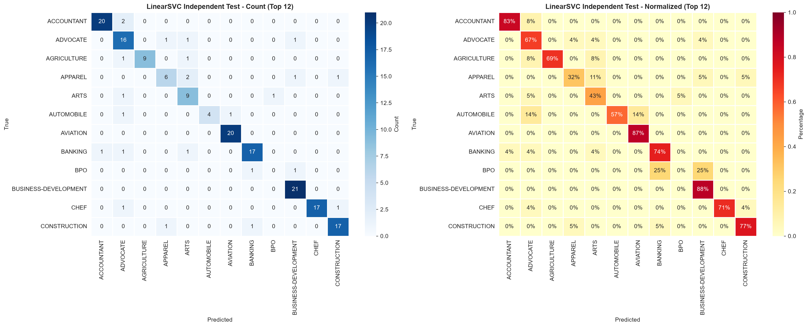

# AI Resume Classifier — 英文简历职业分类系统

[](https://www.python.org/)
[](https://scikit-learn.org/)
[](https://flask.palletsprojects.com/)
[](#测试)
[](LICENSE)

基于传统 NLP 与监督学习的英文简历职业类别分类系统。项目覆盖数据获取、质量检查、EDA、TF-IDF 特征工程、多模型验证集选型、独立测试集评估、错误分析、模型持久化和 Flask API。

> 本项目预测简历所属的职业类别，并不输入岗位 JD，因此不把结果表述为候选人与具体岗位的匹配分数。

## 项目展示


## 实验设计与结果

- 数据集：Kaggle Resume Dataset
- 有效样本：2,481 份英文简历
- 类别：24 个职业类别
- 数据划分：训练集 1,587 / 验证集 397 / 独立测试集 497
- 特征：5,000 维 TF-IDF，unigram + bigram
- 选模指标：验证集 Macro F1（所有类别等权）
- 最终模型：校准后的 LinearSVC

### 验证集模型对比

| 模型 | Accuracy | Weighted F1 | Macro F1 | 训练时间 |
|---|---:|---:|---:|---:|
| Logistic Regression | 0.6222 | 0.6048 | 0.5737 | 119.13s |
| **LinearSVC** | 0.6751 | 0.6685 | **0.6339** | 1.34s |
| Random Forest | **0.6977** | **0.6765** | 0.6338 | 0.90s |
| Multinomial Naive Bayes | 0.5113 | 0.4797 | 0.4402 | **0.01s** |

模型只根据验证集 Macro F1 选择。选定 LinearSVC 后，使用训练集与验证集重新拟合，再对此前未参与选择的测试集评估一次。

### 独立测试集

| Accuracy | Weighted F1 | Macro F1 |
|---:|---:|---:|
| 0.7284 | 0.7208 | 0.6930 |



### 错误分析

程序会生成 [`static/error_analysis.json`](static/error_analysis.json)：

- BPO 测试集仅有 4 个样本，F1 为 0，是当前最明显的长尾短板。
- 最常见混淆为 FINANCE → ACCOUNTANT（6 条）。
- 其他较明显混淆包括 ARTS → TEACHER、SALES → BUSINESS-DEVELOPMENT。

这些结果说明 72.84% Accuracy 不能代表所有类别都同样可靠，扩充少数类数据比继续强调单一总分更重要。

## 快速开始

```bash
python -m venv .venv

# Windows
.venv\Scripts\activate

# macOS / Linux
source .venv/bin/activate

pip install -r requirements.txt
```

首次运行需要配置 Kaggle API。若 `data/resume_dataset.csv` 不存在，一键流水线会自动调用数据下载脚本。

```bash
# 数据下载（如需要）→ 清洗 → EDA → 特征工程 → 训练与评估
python pipeline.py

# 重训练时跳过 EDA 图表生成
python pipeline.py --skip-analysis
```

启动 Web 应用：

```bash
python run.py
```

浏览器访问 `http://127.0.0.1:5000`。

## 测试

测试不依赖被 Git 忽略的数据集和模型文件，克隆仓库并安装依赖后即可运行：

```bash
pytest -q
```

当前覆盖文本清洗、API 输入校验、健康检查、推理错误处理和错误分析逻辑，共 14 项测试。

## API

### `POST /predict`

```json
{
  "resume_text": "Software engineer with five years of Python and cloud experience..."
}
```

成功响应：

```json
{
  "success": true,
  "category": "INFORMATION-TECHNOLOGY",
  "confidence": 0.81,
  "top_k": [
    {"category": "INFORMATION-TECHNOLOGY", "confidence": 0.81}
  ]
}
```

`confidence` 来自校准分类器的概率输出，不应解释为录用概率或候选人与具体 JD 的匹配率。

### `GET /health`

```json
{
  "status": "ok",
  "model_ready": true
}
```

## 项目结构

```text
├── app/                       # Flask 应用与 API
├── data/                      # 本地数据（Git 忽略）
├── models/                    # 模型产物（大文件由 Git 忽略）
├── static/                    # EDA、模型评估和错误分析产物
├── tests/                     # 可独立运行的自动化测试
├── data_cleaning.py           # 数据质量检查与文本清洗
├── feature_engineering.py     # 三份数据划分与 TF-IDF
├── train.py                   # 四模型训练、选型与最终评估
├── predict.py                 # 推理封装
├── text_processing.py         # 训练/推理共享文本预处理
└── pipeline.py                # 一键可复现流水线
```

## 已知限制

- 仅针对英文纯文本简历，尚未实现 PDF/DOCX 解析。
- 数据规模较小，BPO、AUTOMOBILE 等少数类评估方差较大。
- 当前任务是职业类别分类，不是简历与 JD 的双文本匹配。
- 模型在 Kaggle 数据上训练，应用到其他地区或行业的数据前需要重新验证。

## License

[MIT](LICENSE)
